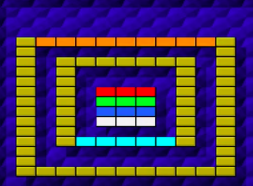

# Game Plan
## Hosam Tageldin (ht120) Wyatt Focht (wgf6)

### Breakout Variation Ideas

### Interesting Existing Game Variations

 * Game 1- Super breakout: 
This game was really interesting because of the amount of varying features that were included. The idea of dro
pping positive and negative points from the broken blocks was very interesting. Also dropping powerups from the blocks led to a very fun layout. Some of these powerups included a wider paddle, multiple balls and shooting lasers out of the paddle. It was also really interesting that as the player advances through the games, the blocks take more hits to break them.

 * Game 2 - Centipong
The idea of having a moving target (centipede being the blocks) was a very interesting feature. The centipede then breaking into multiple balls made the game really entertaining to watch. It was also interesting that the paddle was not always flat at the bottom and was angled in different ways throughout the game which helped the player aim it in a more precise way to hit the blocks. The powerup to slow everything down was a great feature and seemed much needed when there were a large amount of balls bouncing everywhere.

* Game 3- Devilish
The objective of flying through the blocks was very interesting. It gave the breakout game a very different and entertaining feel to it. Also the idea of having two layers of paddles seemed unique and gave us the idea of maybe incorporating that as a power up within our game. The round being finished once the ball entered the hole was also a great way to end this unique version.

#### Block Ideas

 * Block 1: Grey block (requires three hits by ball)

 * Block 2: White block (two hits)

 * Block 3: Normal randomly-colored block (one hit)

 * Block 4:  A Black block (doesn’t get broken but serves as an obstacle to hitting the other blocks) 

#### Power Up Ideas

 * Power Up 1: Ball Speed Up and/or Slow Down

 * Power Up 2: Increase Paddle Size

 * Power Up 3: Extra Life

 * Power up 4: Multiple balls
 

#### Cheat Key Ideas

 * Cheat Key 1: Type R: reset everything to original position 
 
* Cheat Key 2: Space: pause game

 * Cheat Key 3: Type 307: get extra life 

 * Cheat Key 4: Left+Right+Left+Right+Down+Up+Down+Up: increase paddle size for limited time

#### Level Descriptions

 * Level 1
   * Block Configuration
  
  
   * Variation features- After a given time period, all blocks shift one space to the left or right

 * Level 2
   * Block Configuration

  
   * Variation features - Ball moves a little faster and the paddle size randomly changes throughout the level

 * Level 3
   * Block Configuration
   
  
   * Variation features - Brick falls and if it hits the paddle, the game is over, paddle at the top of the screen 

### Possible Classes

 * Class 1: Paddle
   * Purpose: Sets and maintains the properties of the paddle 

   * Method: setPaddleSize (set height and width of user’s paddle)

 * Class 2: Ball
   * Purpose: Sets the properties of the ball 

   * Method: setBallSpeed (set speed that ball is moving at)

 * Class 3: Game
   * Purpose: Sets the scene of the game and controls the cheat keys/ powerups involved

   * Method: setupScene (sets up initial scene utilizing paddle size, block configuration, ball speed...etc) 

 * Class 4: Block
   * Purpose: Sets the properties of each type of block and the positioning 

   * Method: checkRemainingHits (checks to see how many hits a block has remaining before it disappears)

 * Class 5: FileReader
   * Purpose: Reads in the text file and interprets the block configuration to be laid out in the initialization of the game

   * Method: readLine (reads a line from the text file to determine the block properties including coordinate positioning, type and size of block)
